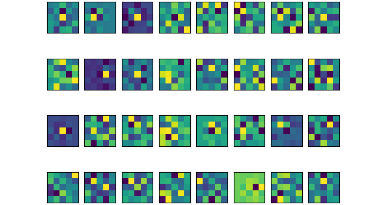
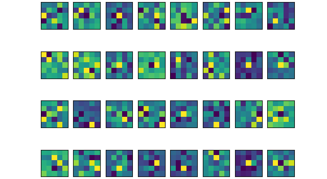
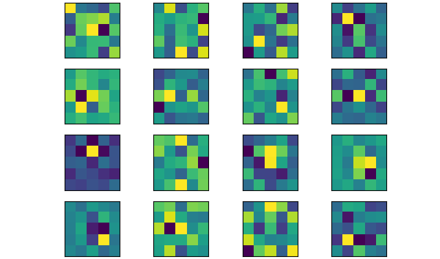
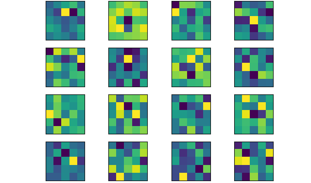
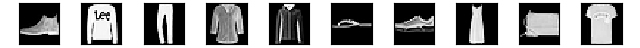
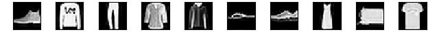
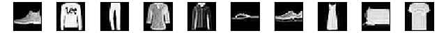
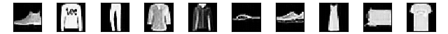

# DSP Final Project

## 簡介

前次作業為全連接的編解碼器，這次改為用CNN的convolution/deconvolution的形式，進行單層的編碼與解碼。

然而，將影像進行convolution得到的feature map大小和原影像大小是一致的(在有padding的情形下)，且會因kernel的數量設定得到一個較厚的volume。因此，不像上次作業一樣，可以確定影像有被編碼成較小容量的編碼，不能簡單判定convolution出來的volume得到了壓縮(稀疏表示)。若嘗試以sparse coding的精神，去最小化非零項的個數(如在tensorflow裡的count_nonzero函數，或使用sparse coding實務上常用的norm 1)，或許可以得到理想的稀疏表示法。

若撇開強制稀疏性不談，在做deconvolution時根據[此篇](https://distill.pub/2016/deconv-checkerboard/)所敘述，單純的deconvolution容易產生網格狀失真，改善的方法先進行內差放大activation map後再進行convolution，兩種方式都實驗看看是否得到品質改善。此外，可以由convolution的kernel大小以及數量兩個變因進行調整。將學到的kernel顯示出來，觀察是否為不重複且常見的feature filters。

## 實驗

### 預設網路架構

kxk n個 convolution kernels => linear/relu => activation map => kxk 1個 convolution kernels 

256 samples/batch, Adam default parameters, 50 epochs

### Activation map稀疏表達的可能性

可以藉由norm 1(對activation map取絕對值加總)進行稀疏化。然而，要達到真正的稀疏性，也就是要為0或足夠接近0才能算為稀疏，在單純的線性模型下較難以調整到，若加了ReLU就容易許多，實驗也證實了此現象。因此，對於稀疏的強制性我會加入ReLU轉換來進行實驗。

整個Loss函數變為:

$$
MSE(X, \hat{X}) + \beta Average(|\texttt{ActivationMap}|)
$$
其中$\beta$是稀疏項的權重值，我們的目標還是為了要還原$X$，因此這裡設$ \beta=0.5 $

### Convolution的參數選擇，對稀疏編碼的難易程度

這邊列表出convolution kernel的大小、數量選擇，經過50 epoch的訓練後，能到達的稀疏程度以及對整個training set的MSE表現：

Kernel 3x3

| 數量   | 平均稀疏度(%/batch) | 平均非零元素數量(per batch) | Training set MSE |
| ---- | -------------- | ------------------- | ---------------- |
| 16   | 89.51          | 336346              | 6.76             |
| 32   | 94.02          | 383112              | 0.846            |
| 64   | 97.01          | 382588              | 0.688            |
| 128  | 98.08          | 492601              | 0.338            |

Kernel 5x5

| 數量      | 平均稀疏度(%/batch) | 平均非零元素數量(per batch) | Training set MSE |
| ------- | -------------- | ------------------- | ---------------- |
| 16      | 91.01          | 288222              | 2.48             |
| 32      | 95.84          | 267050              | 2.79             |
| 64      | 97.76          | 286404              | 1.36             |
| 128[^1] | 98.49          | 388491              | 0.495            |

這邊列了沒有稀疏強制的表現作為比較，kernel數量固定為32：

| kernel大小 | 數量   | 平均稀疏度(%/batch) | 平均非零元素數量(per batch) | Training set MSE |
| -------- | ---- | -------------- | ------------------- | ---------------- |
| 3x3      | 32   | 45.47          | 3498465             | 0.074            |
| 5x5      | 32   | 42.21          | 3707662             | 0.878            |

根據以上實驗，證實了kernel數愈多，可以達到愈稀疏的表示法，且可以達到更好的還原。但就非零元素數量而言，量級上並沒太的變動。且在大kernel的情形下，平均來說還原品質會比小kernel來得差，但非零元素量卻比小kernel來的少，也較為稀疏。

在沒有稀疏條件下，還原效果好到差一個量級，不意外。但這邊稀疏程度不具參考價值，因為可能因不同的初使化方式而有所變動。

然而，綜觀非零元素的數量，若以每batch有300000個非零數，則平均每張影像所編到的非零元素數量為$300000/256\approx1172$，並沒有達到壓縮的效果，反倒增加了資料量。因此，若單純用這樣的架構實現壓縮是不可行的。

[^1]: 由於參數較多，訓練時epoch次數增加到100

### Kernel長相

延續稀疏限制的模型，比較有限制和沒限制所學出來的kernel是否長的一樣。這邊convolution用的是5x5的kernel，數量為32，一樣有加入ReLU進行非線性轉換：

有稀疏限制

無稀疏限制

 就結果而言，兩種模式下都看不出有什麼特別的規則。如果將kernel降至16：
 有稀疏限制

無稀疏限制

兩者也是看不出有什麼規則。

### Upsampling： resize-convolution vs deconvolution

比較的方式如果在比較常見的情況下進行比較會比較有意義。因此，在不做稀疏限制下，比較的網路為:

kxk 32個 convolution kernels => linear/relu => **2 stride 2x2 maxpooling** => activation map => kxk 1個 deconvolution kernels / nxn 1個 resize-convolution

這邊resize-convolution用的內插法是nearest-neighbor；deconvolution的stride是2：

| 方法            | kernel大小 | Training set MSE |
| ------------- | -------- | ---------------- |
| resize-conv   | 3        | 44.70            |
| deconvolution | 3        | 39.71            |
| resize-conv   | 5        | 42.23            |
| deconvolution | 5        | 35.68            |

Test set重建結果

原始影像

resize-conv 3x3

resize-conv 5x5

deconvolution 3x3

deconvolution 5x5

實驗結果發現，deconvolution來的比resize-convolution來的好，且也沒有網格狀的失真，和distill所實驗的結果不一致。這有可能是這次實驗的影像較為簡單，不像一般較大的彩色影像複雜，且網路也才單層[^1]。但就這次實驗結果而言，deconvolution還是較佳。

如果仔細觀察數據，5x5的重建會比3x3效果來的好，和稀疏限制的實驗有不一樣的趨勢。不一樣的地方是沒有了稀疏限制和加入了maxpooling。這邊直覺上是因為maxpooling造成的，可以再設計實驗證實大kernel可以彌補maxpooling的假說。

[^1]: 其實有試著實驗雙層網路，進行了兩次maxpooling，然而deconvolution的結果並沒有變差或有網格狀的失真

